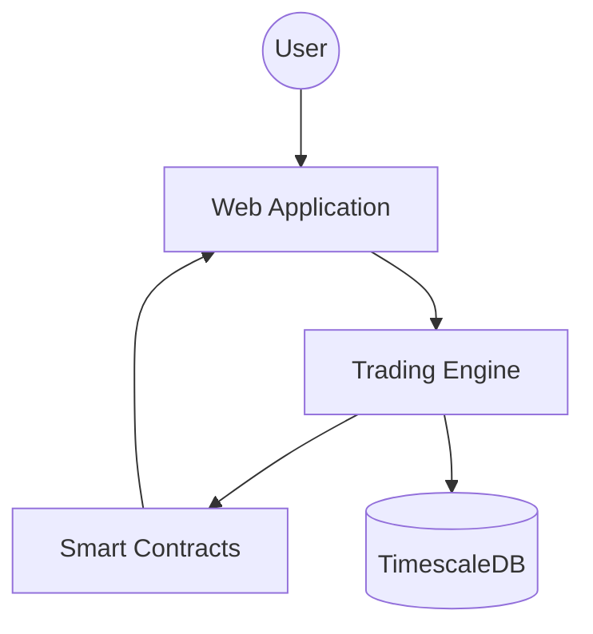

# Architecture Decision Records (ADR)

This directory contains records of significant architectural decisions made during the development of ProphetBase.

## Decision Log

| ID | Title | Date | Status |
|----|-------|------|--------|
| [ADR-001](adr/001-template.md) | Initial Tech Stack Selection | 2026-01-20 | Approved |
| [ADR-002](adr/002-state-management.md) | React Query for Server State | 2026-01-22 | Approved |
| [ADR-003](adr/003-trading-engine.md) | Algorithmic Trading Architecture | 2026-01-29 | Proposed |

---

## System Overview

### Components

1. **Frontend**: Next.js 14, Tailwind CSS, Shadcn UI.
2. **Trading Engine**: TypeScript-based executor for algorithmic trades.
3. **Smart Contracts**: Solidity/Clarity contracts for on-chain settlement.
4. **Data Layer**: TimescaleDB for time-series trading data and S3 for snapshots.

## Key Principles

- **Security First**: All on-chain interactions must be verified and audited.
- **Accessibility**: Support keyboard navigation and screen readers across the platform.
- **Performance**: Sub-second response times for all UI interactions.
- **Interoperability**: Standardized API for third-party integrations.
